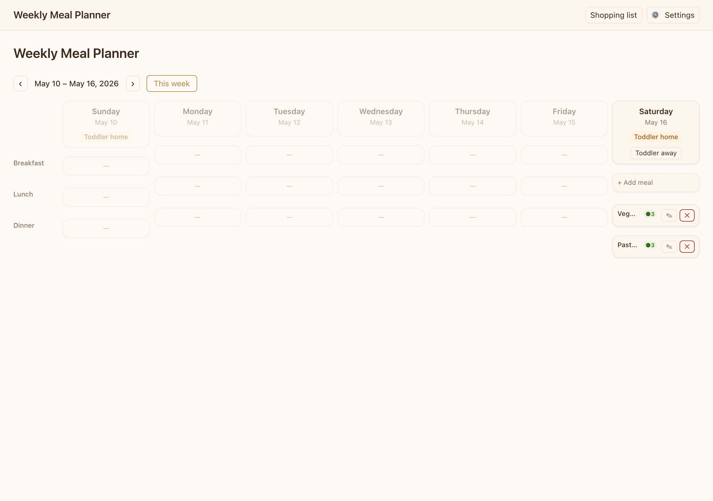
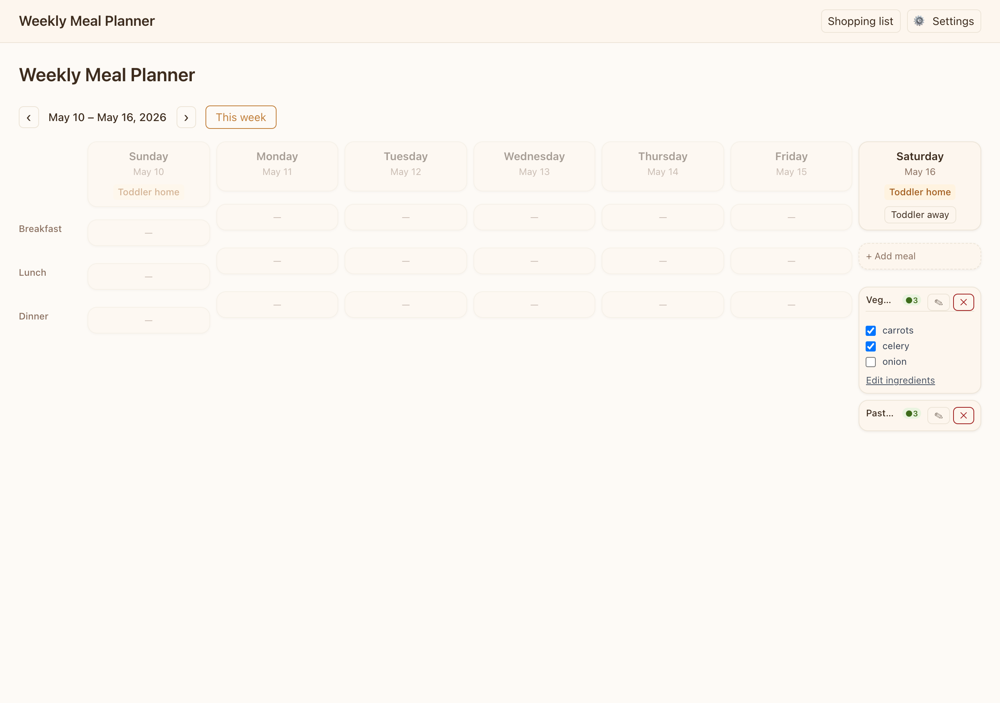
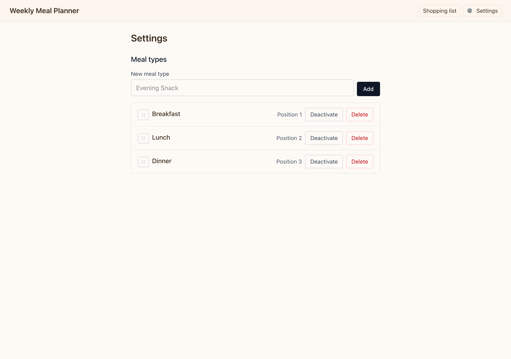
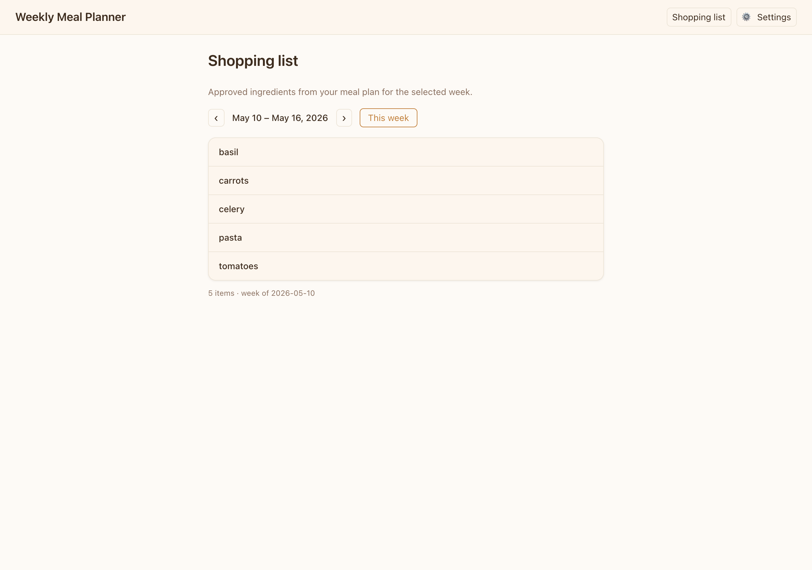

# Weekly Meal Planner

Single-household weekly meal planner (Next.js 15, SQLite, local Ollama). Built with **Spec-Driven Development (SDD)** — specs and plans are the contract; agents implement against them.

## Screenshots

### Meal plan grid

Weekly grid with warm tokens, toddler-day labels, status badges, and collapsible meal slots.



### Expanded meal slot

Ingredient checklist with approve toggles; approved items sync to the shopping list.



### Settings

Meal types and household configuration.



### Shopping list

Deduped approved ingredients for the selected week (print-friendly).



## Quick start

```bash
cp .env.example .env.local   # edit HOME_TIMEZONE, OLLAMA_*, DATABASE_URL
grep '^DATABASE_URL=' .env.local > .env   # Prisma IDE extension (optional)
npm install
npm run db:migrate
npm run db:seed
npm run dev
```

Open `http://localhost:3000`. Settings: `/settings`.

## Viewing specs

Committed specs are Markdown under `sdd/` — GitHub renders Mermaid in [`sdd/architecture.md`](sdd/architecture.md) and each feature’s `spec.md` / `plan.md`.

Optional HTML rollups (`feature-00X.html`, mockups) are **gitignored** and stay on your machine. Open them locally in a browser; they are not published to GitHub, GitHub Pages, or htmlpreview.

## Architecture

System overview (deployment, data model, APIs, sequences): [`sdd/architecture.md`](sdd/architecture.md).

## How SDD was used on this project

SDD here follows **Specify → Plan → Tasks → Implement**. The AI does not make architecture calls; the spec does.

```
.cursor/rules/project-constitution.mdc   ← non-negotiable rules (always loaded in Cursor)
sdd/00X-feature/
  spec.md              ← what / AC (public)
  spec.local.md        ← household context (gitignored; copy from .example)
  plan.md              ← schema, API, components
  tasks.md             ← atomic tasks, one chat + one commit each
  decision-log.md      ← deviations and env notes
  feature-00X.html     ← local rollup of spec + plan (gitignored; optional)
```

### Workflow in practice

1. **Constitution** — timezone, Ollama fire-and-forget, past days read-only, no auth, Sunday week start ([`project-constitution.mdc`](.cursor/rules/project-constitution.mdc)).
2. **Specify** — `spec.md` with personas, journeys, numbered acceptance criteria (AC-001…).
3. **Plan** — `plan.md` with Prisma shape, API routes, component tree, sequence diagrams.
4. **Tasks** — `tasks.md` tracer bullets: files touched, done-when, blocked-by, explicit “do not”.
5. **Issues** — tasks exported to GitHub Issues (`feature-001`, `ready-for-agent`, blockers in issue body).
6. **Implement** — Cursor chats scoped to one task or issue; agent skills under [`.agents/`](.agents/README.md) (`orchestrate-issues`, `review-*`, `tdd`).
7. **Verify** — sign-off issues and tests mapped to ACs (e.g. `tests/components/feature-001-signoff.test.tsx`).

Example implementer prompt (minimal on purpose):

```
@.cursor/rules/project-constitution.mdc
@sdd/001-meal-plan-grid/plan.md
@sdd/001-meal-plan-grid/tasks.md

Implement T003. Do not go beyond T003.
```

### Features

| Feature | Spec | Status |
|---------|------|--------|
| 001 — Meal plan grid | [`sdd/001-meal-plan-grid/spec.md`](sdd/001-meal-plan-grid/spec.md) | Implemented |
| 002 — Configuration | [`sdd/002-configuration/spec.md`](sdd/002-configuration/spec.md) | Implemented |
| 003 — Shopping list | [`sdd/003-shopping-list/spec.md`](sdd/003-shopping-list/spec.md) | Implemented |

### Public vs private context

Household-specific cuisine and toddler diet live in **gitignored** files (`spec.local.md`, `.cursor/rules/household-context.mdc`). Committed `.example` templates show the shape without personal data — same pattern as `.env` / `.env.example`.

### Agent skills

See [`.agents/README.md`](.agents/README.md) for `orchestrate-issues`, reviewers, and `to-issues`.

## Scripts

| Command | Purpose |
|---------|---------|
| `npm run dev` | Next.js dev server |
| `npm test` | Vitest (API + components) |
| `npm run db:migrate` | Prisma migrate |
| `npm run db:seed` | Seed meal types |
| `npm run capture-screenshots` | Regenerate `docs/screenshots/` (app must be running) |

## Docker

```bash
docker compose build && docker compose up -d
```

Ollama on the host: set `OLLAMA_HOST=http://host.docker.internal:11434` in Compose (see `.env.example` and `sdd/001-meal-plan-grid/decision-log.md` DL-013).

## License

Private household project; adjust license if you fork publicly.
