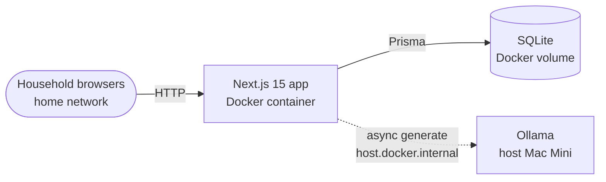
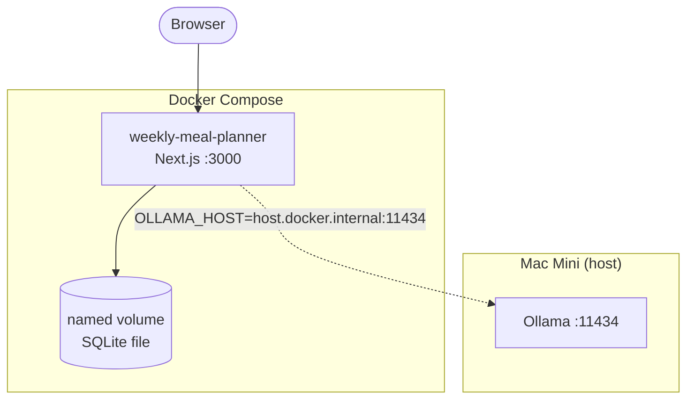
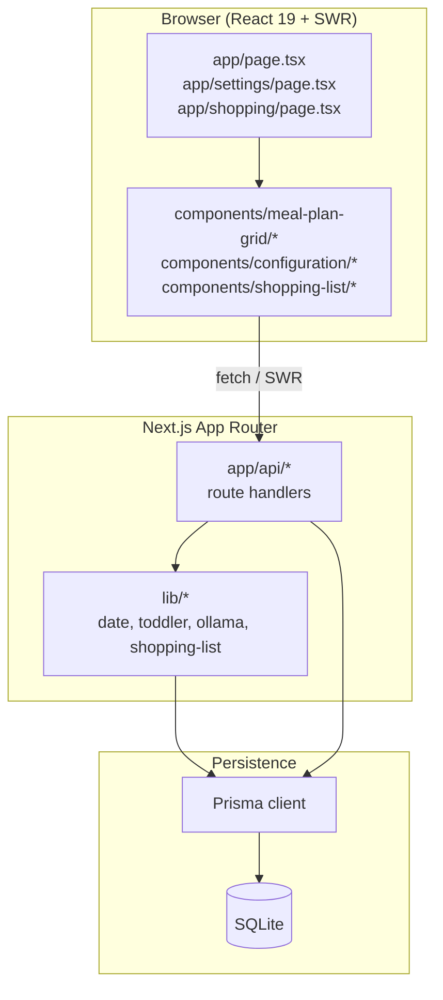
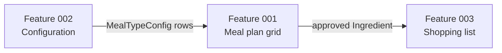
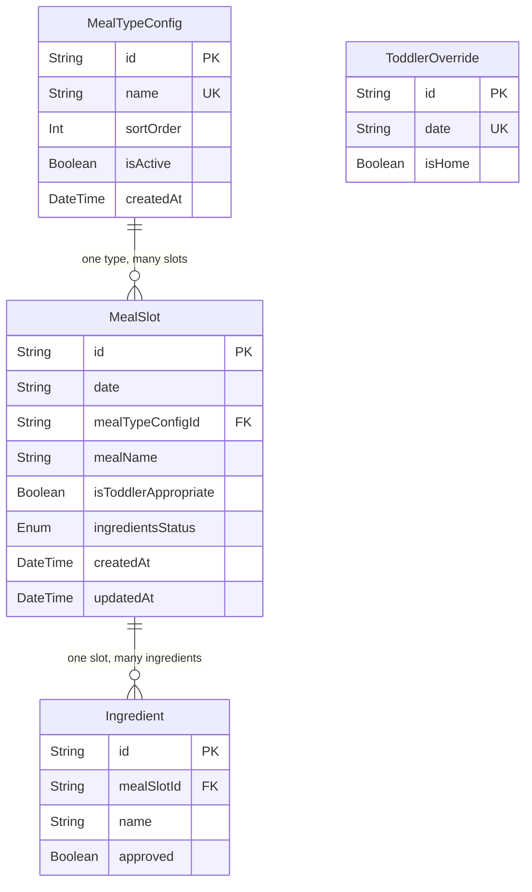
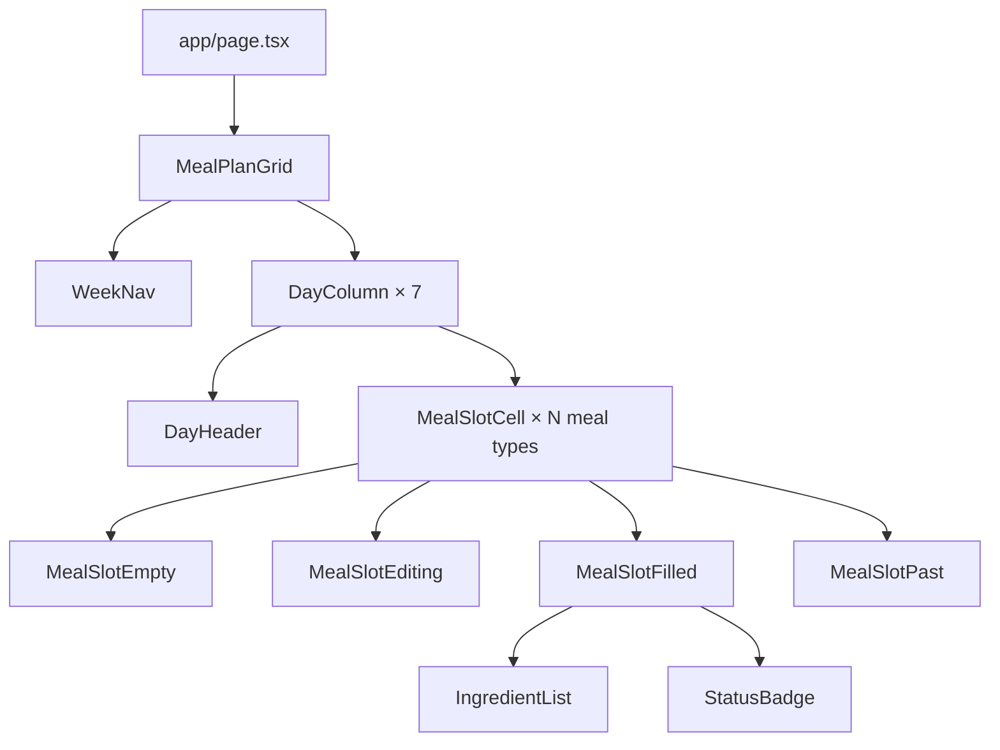
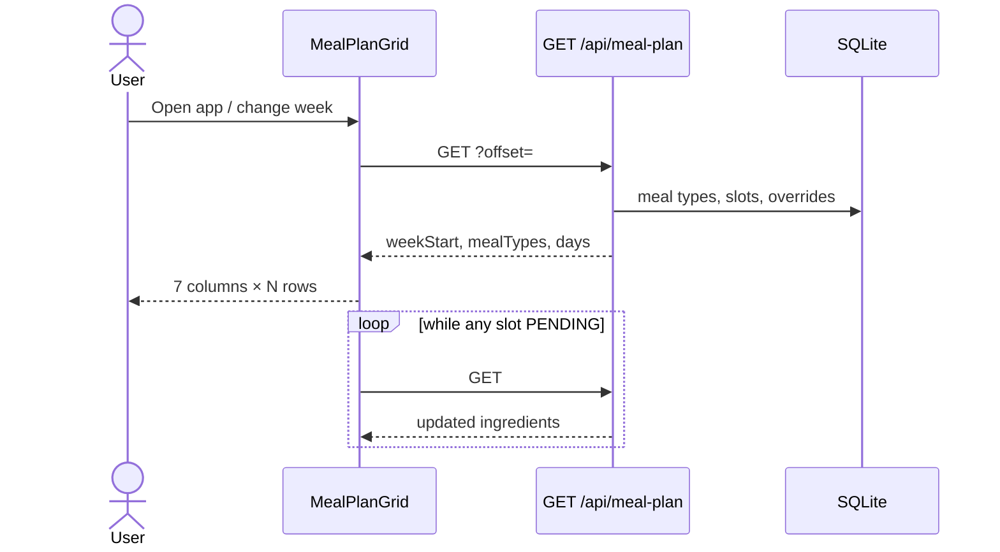
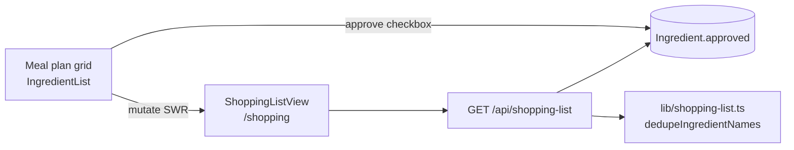
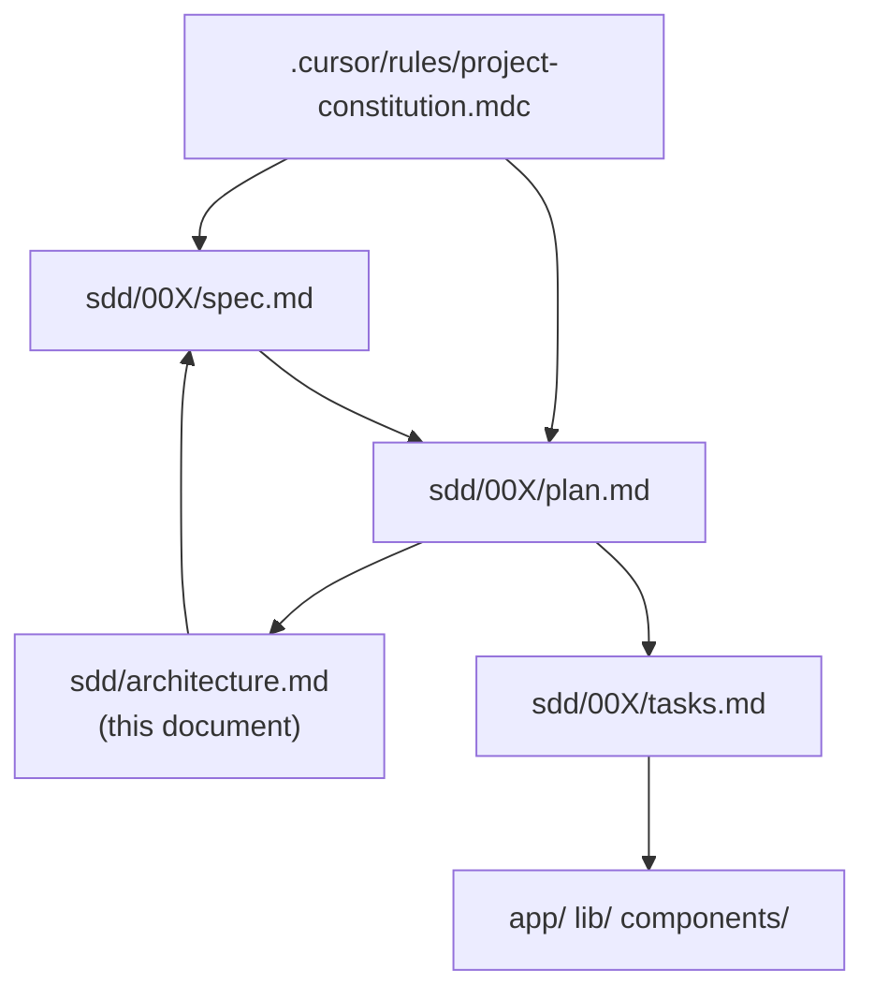

# Weekly Meal Planner — Architecture

System architecture for the household meal planner. Derived from the [project constitution](../.cursor/rules/project-constitution.mdc) and feature plans (`001`–`003`).

**Related docs**

| Doc | Purpose |
|-----|---------|
| [Feature 001 — Meal plan grid](001-meal-plan-grid/spec.md) | Grid, slots, Ollama ingredients, toddler overrides |
| [Feature 002 — Configuration](002-configuration/spec.md) | Meal type CRUD, reorder, soft-delete |
| [Feature 003 — Shopping list](003-shopping-list/spec.md) | Approved-ingredient aggregation |
| [Feature 001 HTML rollup](001-meal-plan-grid/feature-001.html) | Interactive spec with detailed diagrams |

---

## 1. System context

Single-household app on a home Mac Mini. No cloud, no auth, no multi-tenancy. Two adults plan meals; toddler constraints are enforced by rules and overrides, not by a separate user account.



**Invariants** (constitution §3): home timezone for all day boundaries; weeks start Sunday; past days read-only; saves never block on Ollama; ingredient generation is fire-and-forget.

---

## 2. Deployment



| Concern | Choice |
|---------|--------|
| App runtime | Docker multi-stage build (`docker-compose.yml`) |
| Database | SQLite on a **mounted volume** (never baked into the image) |
| AI | Ollama on the **host** only — not a Compose service |
| Config | `.env.local` → `lib/config.ts` (`HOME_TIMEZONE`, `OLLAMA_*`, `DATABASE_URL`) |

---

## 3. Application layers



| Layer | Location | Responsibility |
|-------|----------|----------------|
| Routes (UI) | `app/` | Pages: `/`, `/settings`, `/shopping` |
| Routes (API) | `app/api/` | JSON REST handlers |
| Domain logic | `lib/` | Dates, toddler rules, Ollama, dedupe, serialization |
| UI | `components/` | Grid, configuration, shopping list, nav |
| Schema | `prisma/schema.prisma` | `MealTypeConfig`, `MealSlot`, `Ingredient`, `ToddlerOverride` |

---

## 4. Features and data flow



| Feature | User-facing | Writes data? | Reads |
|---------|-------------|--------------|-------|
| **001** | Weekly grid, slots, ingredients, toddler day toggles | `MealSlot`, `Ingredient`, `ToddlerOverride` | `MealTypeConfig` (active only) |
| **002** | Settings: add/rename/reorder/deactivate meal types | `MealTypeConfig` | All meal types |
| **003** | Shopping list (print-friendly) | None (read-only aggregation) | Approved ingredients for week |

---

## 5. Data model

Dates are stored as `YYYY-MM-DD` strings in the home timezone. One slot per `(date, mealTypeConfigId)`.



**`ingredientsStatus`** on `MealSlot`: `PENDING` | `READY` | `FAILED` | `EMPTY` — set at save time from Ollama reachability; updated asynchronously when generation completes.

---

## 6. API surface

```mermaid
flowchart LR
    Client([Browser / SWR])

    Client --> MP["GET /api/meal-plan"]
    Client --> MS["POST /api/meal-slots"]
    Client --> MSI["PATCH/DELETE\n/api/meal-slots/[id]"]
    Client --> ING["PATCH\n/api/meal-slots/[id]/ingredients"]
    Client --> TO["POST /api/toddler-overrides"]
    Client --> MT["GET/POST/PATCH/DELETE\n/api/configuration/meal-types"]
    Client --> SL["GET /api/shopping-list"]

    MP --> DB[(SQLite)]
    MS --> DB
    MS -.->|after() fire-and-forget| OL[Ollama]
    MSI --> DB
    MSI -.->|meal name change| OL
    ING --> DB
    TO --> DB
    MT --> DB
    SL --> DB
```

| Method | Route | Feature |
|--------|-------|---------|
| `GET` | `/api/meal-plan?offset=` | 001 — week grid payload |
| `POST` | `/api/meal-slots` | 001 — create slot + schedule Ollama |
| `PATCH` | `/api/meal-slots/[id]` | 001 — update name (resets ingredients) |
| `DELETE` | `/api/meal-slots/[id]` | 001 — remove slot |
| `PATCH` | `/api/meal-slots/[id]/ingredients` | 001 — manual edit / approve |
| `POST` | `/api/toddler-overrides` | 001 — day home/away override |
| `GET/POST/PATCH/DELETE` | `/api/configuration/meal-types` | 002 |
| `PATCH` | `/api/configuration/meal-types/reorder` | 002 |
| `GET` | `/api/shopping-list?offset=` | 003 — deduped approved names |

---

## 7. Client architecture (Feature 001)

`MealPlanGrid` owns `weekOffset` and `expandedSlotId` (only one expanded cell). SWR key: `/api/meal-plan?offset={n}`. Polls every 3s while any slot is `PENDING`.



Feature 003 reuses `WeekNav` and the same week `offset` semantics. Approving an ingredient in the grid triggers SWR `mutate` for `/api/shopping-list` keys.

---

## 8. Sequence: save meal slot

Slot is persisted before Ollama returns. UI shows the slot immediately; ingredients appear after background generation (or manual entry).

```mermaid
sequenceDiagram
    actor U as User
    participant UI as MealSlotEditing
    participant API as POST /api/meal-slots
    participant DB as SQLite
    participant OL as Ollama

    U->>UI: Confirm meal name
    UI->>API: POST slot
    API->>DB: 403 if past day; 409 if duplicate
    API->>OL: reachability check
    alt reachable
        API->>DB: INSERT PENDING
    else unreachable
        API->>DB: INSERT EMPTY
    end
    API-->>UI: 200 slot
    Note over API,OL: after() — generateIngredients
    API->>OL: generate
    OL-->>API: ingredient list
    API->>DB: READY + Ingredient rows
    Note over UI: SWR polls until not PENDING
```

Implementation: `lib/ollama.ts` (`scheduleIngredientGeneration`), Next.js `after()` so work continues after the response (see decision log DL-013).

---

## 9. Sequence: load week



Week boundaries and `isPast` are computed server-side in `lib/date.ts` using `HOME_TIMEZONE` — the client never imports timezone logic.

---

## 10. Shopping list (Feature 003)



No schema changes. Case-insensitive dedupe, sorted output. Print styles hide nav (`.no-print`).

---

## 11. Configuration (Feature 002)

Settings page manages `MealTypeConfig`: create, rename, reorder (`@dnd-kit`), soft-delete (`isActive: false`). At least one active meal type must remain. Inactive types are hidden from the grid but preserve historical slots.

---

## 12. SDD artifact map



Implementers load constitution + plan + single task per chat. Schema or API changes require a matching spec/plan update before code.
