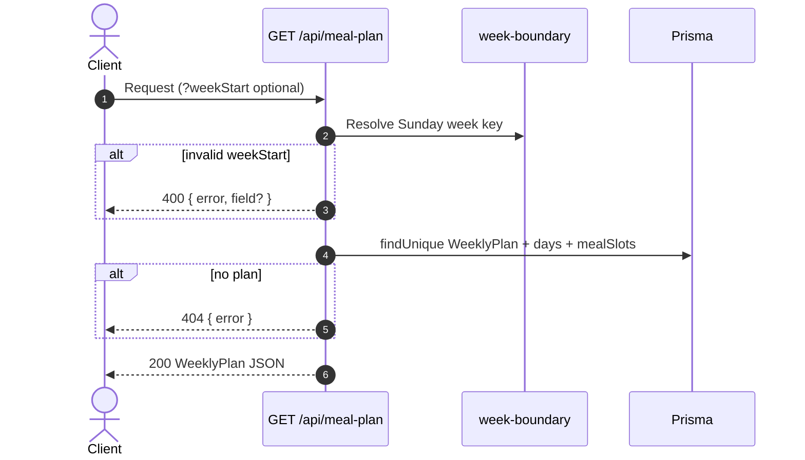
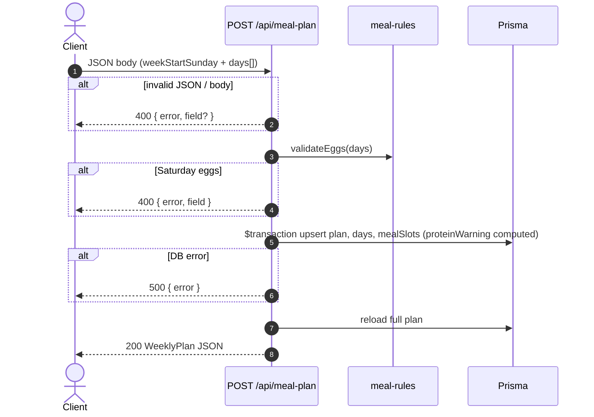
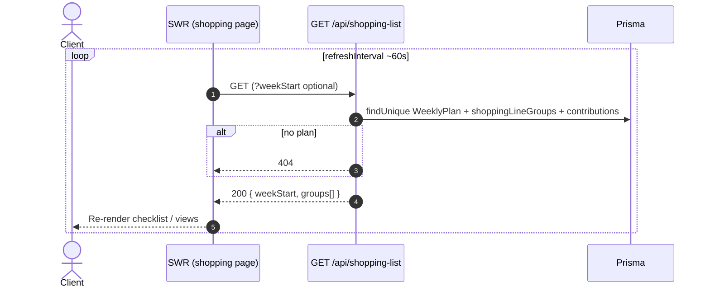
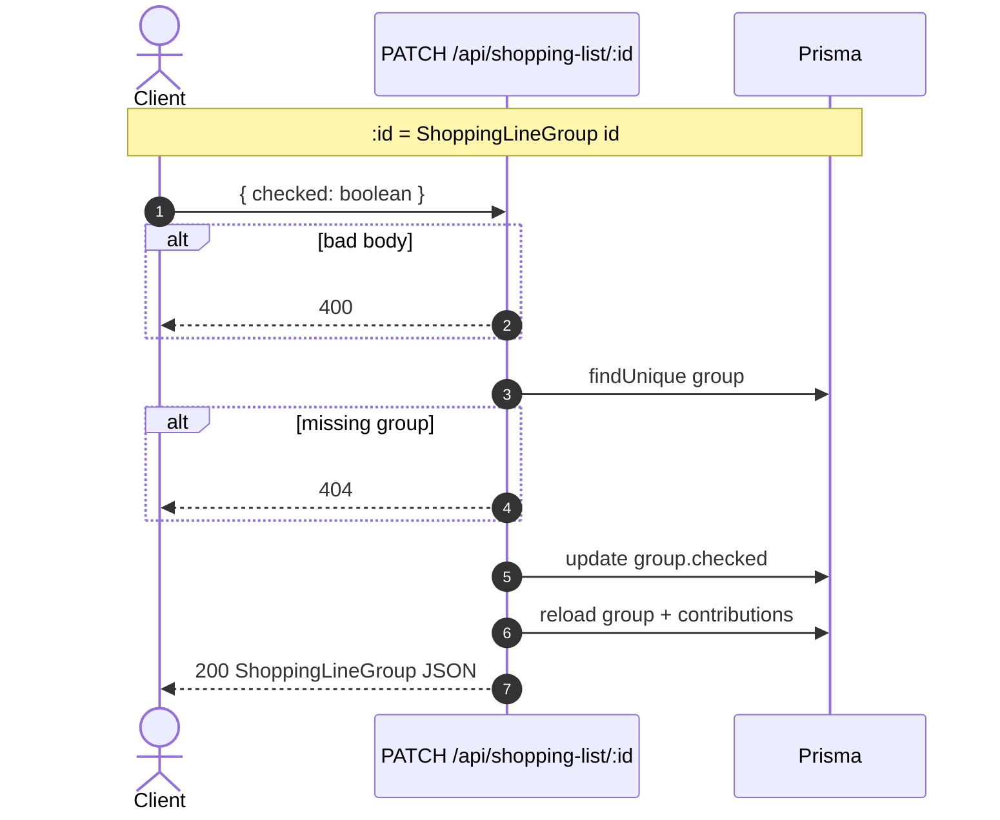
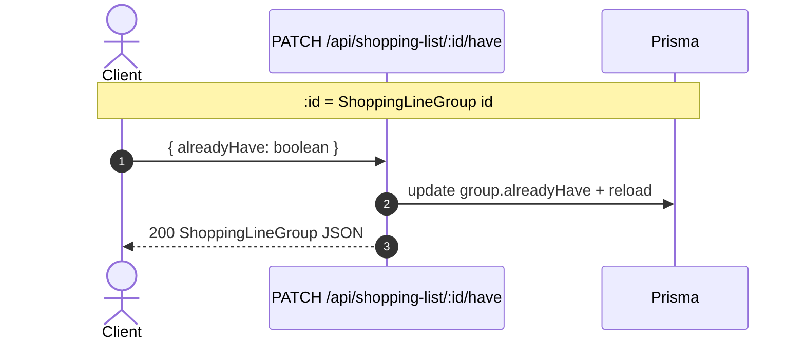
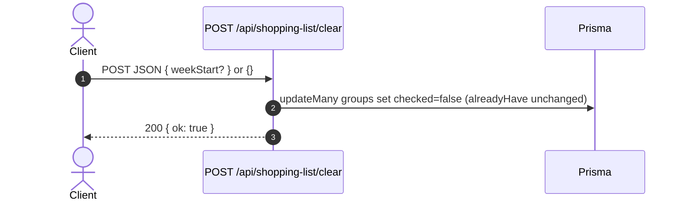
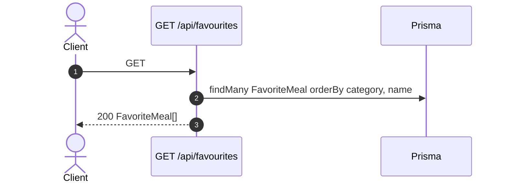

# API sequences (V1)

Mermaid **sequence** diagrams for the main HTTP flows. For paths, bodies, and response shapes, see [`api-routes.md`](api-routes.md) and [`openapi.yaml`](openapi.yaml).

---

## Load weekly meal plan



---

## Save weekly meal plan



---

## Load shopping list (and SWR polling)



---

## Toggle checked (bought today)



---

## Toggle already have (pantry)



---

## Add manual shopping item

```mermaid
sequenceDiagram
  autonumber
  actor Client
  participant API as POST /api/shopping-list/item
  participant DB as Prisma

  Client->>API: weekStart, displayName, quantityText, section, …
  API->>DB: find plan; optional validate mealSlotId in week
  API->>DB: $transaction find/create group by mergeKey; create contribution
  API-->>Client: 201 { contribution, group }
```

---

## Remove one contribution line

```mermaid
sequenceDiagram
  autonumber
  actor Client
  participant API as DELETE /api/shopping-list/:id
  participant DB as Prisma

  Note over Client,DB: :id = ShoppingLineContribution id

  Client->>API: DELETE
  alt unknown id
    API-->>Client: 404
  end
  API->>DB: $transaction delete contribution; maybe delete empty group
  API-->>Client: 204 No Content
```

---

## Clear all checks for the week



---

## List favourites (pick list)


