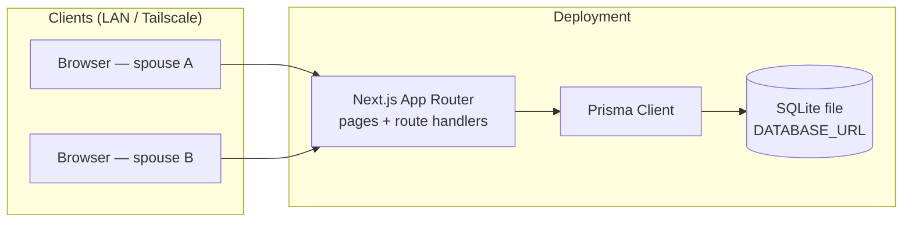
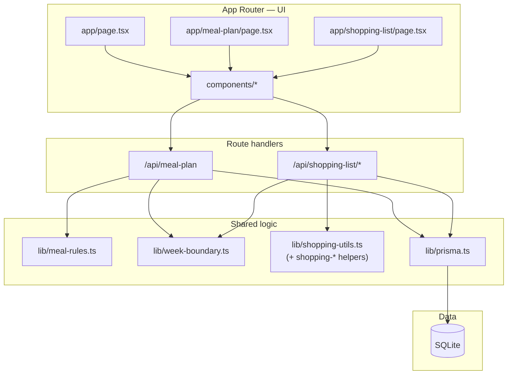
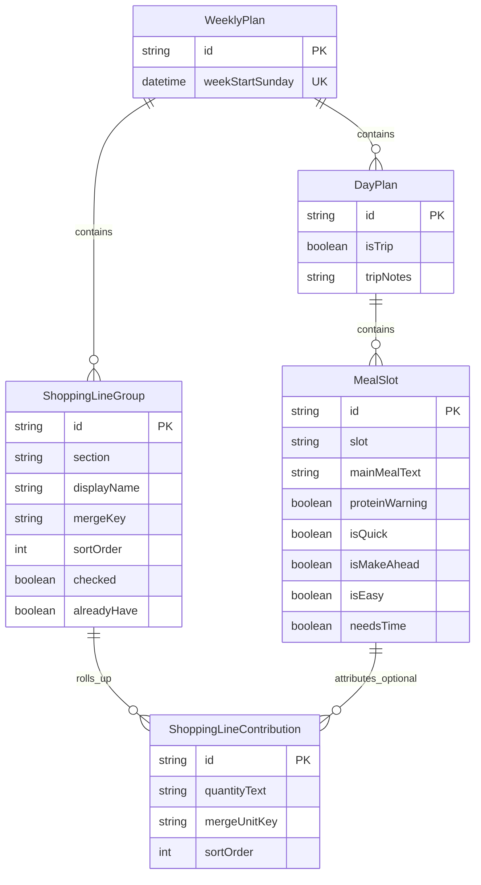
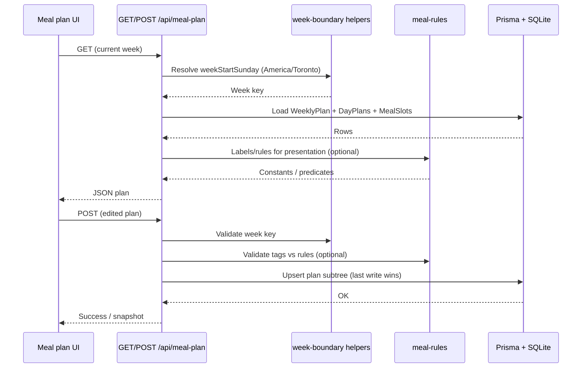
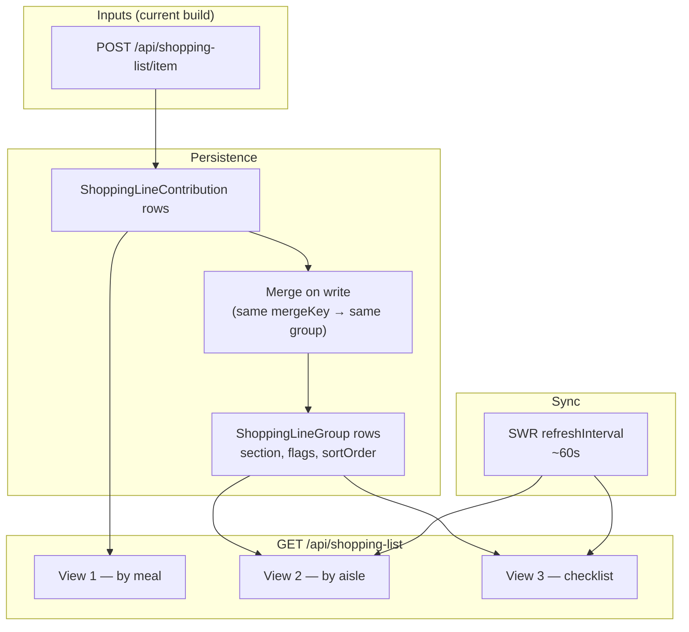
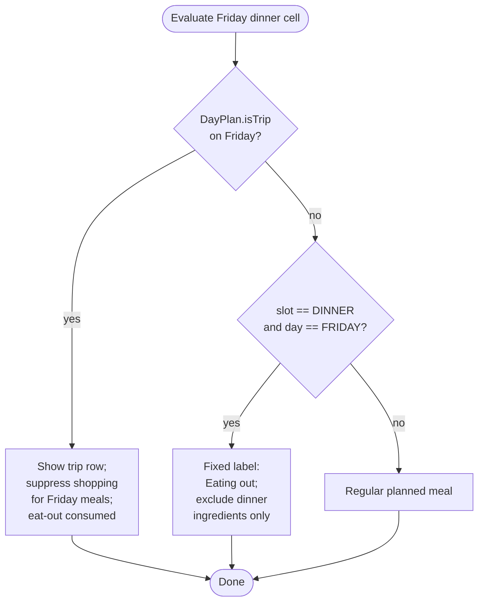

# Architecture and logic flow

Mermaid diagrams for V1: **runtime shape**, **persistence**, and **primary flows**. Render these in GitHub, VS Code (Mermaid preview), or any Markdown viewer that supports Mermaid.

---

## System context

Devices on the home network (often via Tailscale) talk to a single Next.js deployment. No auth in V1; SQLite holds one household’s data.

---

## In-process layering

UI routes consume HTTP APIs or server components that call shared libraries. Rules stay centralized in `lib/meal-rules.ts`; persistence follows `prisma/schema.prisma`.

---

## Data model (conceptual)

One week anchor owns days and shopping groups; each day owns meal slots. Shopping merges many **contributions** into one **group** for aisle/checklist views.

---

## Meal plan load and save

Toronto week resolution picks the active `WeeklyPlan` row (by `weekStartSunday`). Saves replace the nested graph according to your handler design (**last write wins**).

---

## Shopping list: generation, views, and polling

View 1 lists **contributions** by meal; Views 2–3 show merged **groups** (aisle + checklist). The **`/shopping-list`** page uses **SWR** with a **~60 second** refresh on **`GET /api/shopping-list`** for shared checklist state.

**Batch ingredient generation** from the meal grid (`POST /api/shopping-list/generate` in **`SPEC.md`**) is **not implemented** yet; lines still appear from **`POST /api/shopping-list/item`**, tests/seed data, or any future generator.

---

## Eat-out vs trip (Friday)

Fixed eat-out is **Friday dinner** unless **Friday is a trip day**, in which case the trip consumes that week’s eat-out intent and clears normal planning for Friday.

---

## Related docs

- [`data-model.md`](data-model.md) — field-level intent and cascades  
- [`api-routes.md`](api-routes.md) — HTTP surface and flag semantics  
- [`project-structure.md`](project-structure.md) — repository layout  
